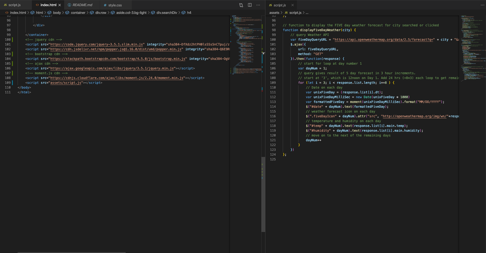

# weather-dashboard

## created by Dominic Parker
https://domjparker.github.io/weather-dashboard/

### Made using HTML, CSS, Bootstrap, jquery, Javascript, and the Open Weather Map API

This is a simple weather forecast application that allows theuser to submit a city name in the search input and get back a one-day forecast, as well as a five-day forecast. I made the project to experiment with querying APIs. It runs in the browser and features dynamically created elements through the use of jQuery. I mostly used Bootstrap in conjunction with HTML, and so there is little in the .css file.

### Here's what it looks like in the browser:

##### Before the user has inputted a city name...

##### When the initial city search has been submitted, the values from the API query are included in dynamically created elements that append to the page. Each time a city is searched for, a button is created for that city.

##### When multiple cities have been searched for, the multiple buttons can be clicked to return the weather forecast values for each button's corresponding city.

### Code
With regards to code, I created most of the structure of the page in HTML, leaving only the city buttons to be dynamically generated, and the values for the forecasts to be appended to the page.
Looking at the .js file, when the user inputs the city name and clicks the search button, this pushes the city name to an array. Each time this happens the any previous buttons on the page are cleared, and new buttons are rendered for any cities in the array (to avoid repeats). The weather forecasts for the searched city are then appended to the page also. If a city button is later clicked, the text(name) from the button is used to query the API and again the weather forecasts are appended to the page.

